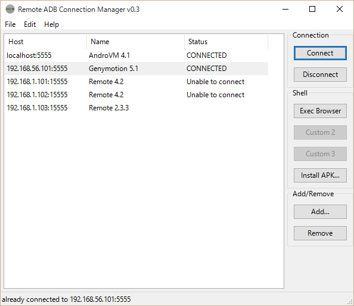
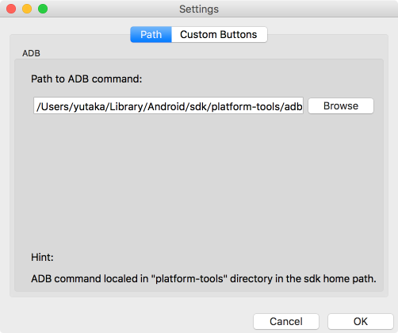
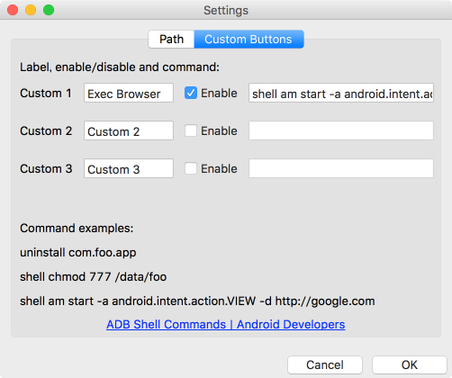

Remote ADB Connection Manager
=============================

RACM (Remote ADB Connection Manager) provides easy way to manage multiple remote ADB (Android Debug Bridge) connections.

## Download

Sources and Windows ".exe" file are located in [releases](https://github.com/mikan/racm/releases) page.

## Background

ADB can connect remote target with `adb connect <host>:<port>` command, but command operations between multiple targets are very troublesome and increase destructive human errors.
RACM has a simple interface allowing easy and safe operation.

The remote ADB connection is often used by custom emulator environments (e.g. AndroVM/Genymotion) and some networked embedded devices (e.g. RICOH's Smart Operation Panel MFP).

NOTE: These are usually required port forwarding settings.

## Settings

When you use the first time, you need to configure the path of ADB command at Settings window from `Edit -> Settings`.

You can customize command shortcuts in `Custom Buttons` tab.

Your configurations are write to `racm.yaml` file in current (same as .exe) directory.

## Requirements

RACM is written in Python and many platforms are supported.
If you use Windows platform, use single .exe file that includes python runtime and many depended libraries.
Other platform users can execute RACM by command line `> chmod u+x racm.py && ./racm.py` after installed depended libraries (see below).

## Libraries

* [wxPython](http://www.wxpython.org/) 3.0
* [PyYAML](http://pyyaml.org/) 3.11

for Windows environment only:

* [Python for Windows Extensions](http://sourceforge.net/projects/pywin32/) 220

## Development Environment

### Windows

* Windows 10 Pro 64bit
* Python 2.7 32bit
* PyCharm 5.0
* wxFormBuilder 3.5.1 RC1
* py2exe 0.6.9

### OS X

* OS X 10.11 El Capitan
* Anaconda Python 2.7
* PyCharm 5.0
* wxFormBuilder 3.5 RC1
* py2app 0.9

## License

RACM is licensed under [New BSD license](LICENSE).
